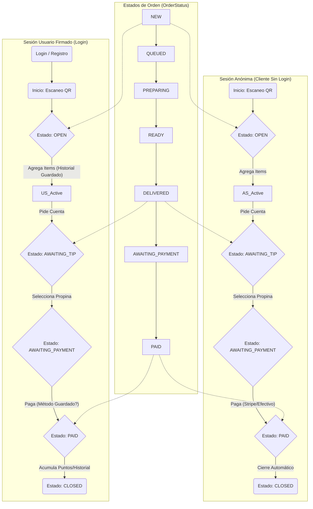
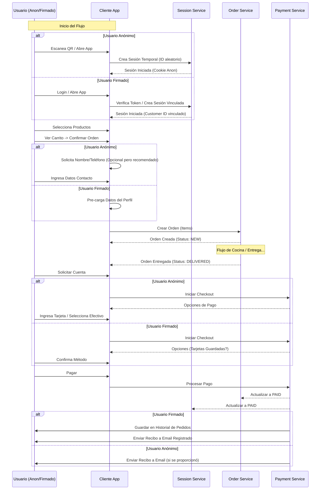

# Flujos del Sistema Pronto

## 1. Ciclo de Vida de Sesión vs. Estado de Orden

Comparativa del flujo de vida de una sesión (Anónima vs. Firmada) en relación con los estados de las órdenes.

## 2. Flujo de Uso de Compra de una Orden

Diferencias entre usuario firmado y no logueado durante el proceso de compra.

