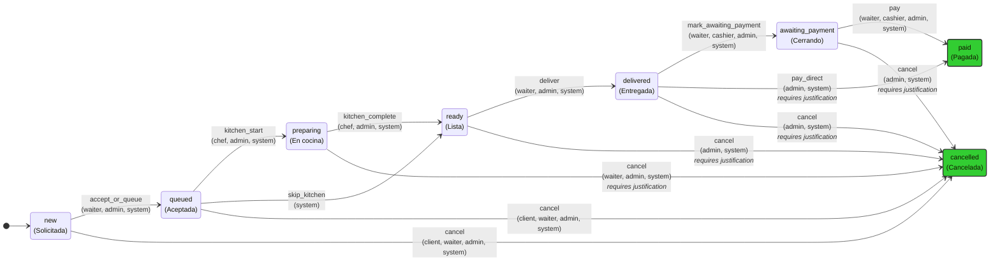

# Order State Machine - PRONTO

## Overview

El sistema de órdenes de PRONTO implementa una **Máquina de Estado Finito (Finite State Machine)** que controla el flujo de vida completo de las órdenes desde su creación hasta su finalización (pago o cancelación).

Este documento describe todos los estados, transiciones válidas, roles autorizados y reglas de negocio asociadas.

## Estados del Sistema

| Estado | Descripción | Tipo |
|--------|-------------|------|
| `new` | Orden creada por cliente | Inicial |
| `queued` | Mesero aceptó la orden | Activo |
| `preparing` | Chef preparando la orden | Activo |
| `ready` | Orden lista para entregar | Activo |
| `delivered` | Orden entregada al cliente | Activo |
| `awaiting_payment` | Esperando confirmación de pago | Activo |
| `paid` | Pago completado | Terminal ✅ |
| `cancelled` | Orden cancelada | Terminal ❌ |

## Diagrama de Estados



## Transiciones Detalladas

### 1. Creación y Aceptación
- **`new` → `queued`**: Mesero acepta la orden
  - Roles: `waiter`, `admin`, `system`
  - Justificación: No requerida

- **`new` → `cancelled`**: Cancelación inmediata
  - Roles: `client`, `waiter`, `admin`, `system`
  - Justificación: No requerida

### 2. Flujo de Cocina
- **`queued` → `preparing`**: Chef inicia preparación
  - Roles: `chef`, `admin`, `system`
  - Justificación: No requerida

- **`queued` → `ready`**: Salto de cocina (pedidos rápidos)
  - Roles: `system`
  - Justificación: No requerida

- **`preparing` → `ready`**: Chef completa preparación
  - Roles: `chef`, `admin`, `system`
  - Justificación: No requerida

### 3. Entrega y Pago
- **`ready` → `delivered`**: Mesero entrega orden
  - Roles: `waiter`, `admin`, `system`
  - Justificación: No requerida

- **`delivered` → `awaiting_payment`**: Solicitar cuenta
  - Roles: `waiter`, `cashier`, `admin`, `system`
  - Justificación: No requerida

- **`awaiting_payment` → `paid`**: Confirmar pago
  - Roles: `waiter`, `cashier`, `admin`, `system`
  - Justificación: No requerida

### 4. Cancelaciones Avanzadas
Las cancelaciones desde estados avanzados requieren justificación:

- **`preparing` → `cancelled`**: Cancelar durante preparación
  - Roles: `waiter`, `admin`, `system`
  - Justificación: **Requerida**

- **`ready` → `cancelled`**: Cancelar orden lista
  - Roles: `admin`, `system`
  - Justificación: **Requerida**

- **`delivered` → `cancelled`**: Cancelar orden entregada
  - Roles: `admin`, `system`
  - Justificación: **Requerida**

- **`awaiting_payment` → `cancelled`**: Cancelar antes del pago
  - Roles: `admin`, `system`
  - Justificación: **Requerida**

### 5. Pagos Directos
- **`delivered` → `paid`**: Pago directo sin solicitar cuenta
  - Roles: `admin`, `system`
  - Justificación: **Requerida**

## Reglas de Negocio Clave

### Roles y Permisos
- **Cliente**: Solo puede cancelar desde `new` y `queued`
- **Mesero**: Puede aceptar, entregar, solicitar pago y cancelar temprano
- **Chef**: Solo maneja transiciones de cocina (`preparing` ↔ `ready`)
- **Cajero**: Solo puede confirmar pagos (`awaiting_payment` → `paid`)
- **Admin/System**: Acceso completo a todas las transiciones

### Estados Terminales
Una vez que una orden alcanza `paid` o `cancelled`, **no se pueden realizar más modificaciones**. Estos son estados finales irreversibles.

### Justificaciones Requeridas
Las cancelaciones desde estados avanzados (`preparing`, `ready`, `delivered`, `awaiting_payment`) **requieren justificación obligatoria** para auditoría y trazabilidad.

## Autoridad Única

Todas las transiciones de estado deben realizarse exclusivamente a través del **OrderStateMachine** ubicado en:

```
pronto-libs/src/pronto_shared/services/order_state_machine.py
```

Cualquier modificación directa de `workflow_status` fuera de este servicio está estrictamente prohibida según las reglas de AGENTS.md.

## Quick Reference Matrix

| Desde → Hacia | new | queued | preparing | ready | delivered | awaiting_payment | paid | cancelled |
|---------------|-----|--------|-----------|-------|-----------|------------------|------|-----------|
| **new** | - | ✅ | - | - | - | - | - | ✅ |
| **queued** | - | - | ✅ | ✅ | - | - | - | ✅ |
| **preparing** | - | - | - | ✅ | - | - | - | ✅* |
| **ready** | - | - | - | - | ✅ | - | - | ✅* |
| **delivered** | - | - | - | - | - | ✅ | ✅* | ✅* |
| **awaiting_payment** | - | - | - | - | - | - | ✅ | ✅* |
| **paid** | - | - | - | - | - | - | - | - |
| **cancelled** | - | - | - | - | - | - | - | - |

✅ = Transición permitida  
✅* = Transición permitida con justificación requerida  
- = Transición no permitida

## Archivos de Referencia

- **Definición de estados**: `pronto-libs/src/pronto_shared/constants.py`
- **Transiciones válidas**: `ORDER_TRANSITIONS` en constants.py  
- **Servicio de estado**: `pronto-libs/src/pronto_shared/services/order_state_machine.py`
- **Validación de transiciones**: `pronto-libs/src/pronto_shared/services/order_transitions.py`

---
*Documento generado automáticamente - Fuente única de verdad: pronto-libs*