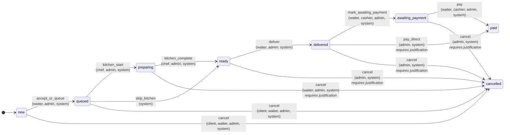

# Vista Previa del Diagrama

El siguiente diagrama muestra la máquina de estado finito para órdenes:

```mermaid
stateDiagram-v2
    direction LR
    
    [*] --> new
    new --> queued: accept_or_queue<br/>(waiter, admin, system)
    new --> cancelled: cancel<br/>(client, waiter, admin, system)
    
    queued --> preparing: kitchen_start<br/>(chef, admin, system)
    queued --> ready: skip_kitchen<br/>(system)
    queued --> cancelled: cancel<br/>(client, waiter, admin, system)
    
    preparing --> ready: kitchen_complete<br/>(chef, admin, system)
    preparing --> cancelled: cancel<br/>(waiter, admin, system)<br/>*requires justification*
    
    ready --> delivered: deliver<br/>(waiter, admin, system)
    ready --> cancelled: cancel<br/>(admin, system)<br/>*requires justification*
    
    delivered --> awaiting_payment: mark_awaiting_payment<br/>(waiter, cashier, admin, system)
    delivered --> paid: pay_direct<br/>(admin, system)<br/>*requires justification*
    delivered --> cancelled: cancel<br/>(admin, system)<br/>*requires justification*
    
    awaiting_payment --> paid: pay<br/>(waiter, cashier, admin, system)
    awaiting_payment --> cancelled: cancel<br/>(admin, system)<br/>*requires justification*
```