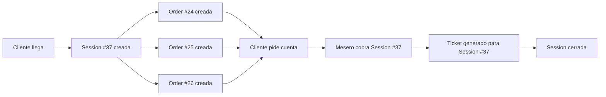

# Order IDs vs Session IDs (Bill IDs)

## Resumen

En Pronto, es importante entender la diferencia entre **Order ID** (ID de Pedido) y **Session ID** (ID de Sesión/Cuenta):

- **Order ID** = Pedido individual
- **Session ID** = Cuenta completa (puede contener múltiples pedidos)

## Conceptos Clave

### 🍽️ DiningSession (Sesión/Cuenta)
- **ID**: `session.id` (ej: #37)
- **Qué es**: Una sesión de comida completa para un cliente en una mesa
- **Contiene**: Una o más órdenes (pedidos)
- **Mostrado como**: "Cuenta #37" o "Bill #37"
- **Uso**: Para pagos, propinas, tickets finales

### 📦 Order (Pedido)
- **ID**: `order.id` (ej: #24)
- **Qué es**: Un pedido individual dentro de una sesión
- **Pertenece a**: Una sesión (DiningSession)
- **Mostrado como**: "Pedido #24" o "Order #24"
- **Uso**: Para seguimiento de cocina, entregas individuales

## Ejemplo Práctico

Un cliente llega a la mesa M05 y crea una **Sesión #37**:

1. **Primera orden**: Cliente ordena café → **Order #24** (dentro de Session #37)
2. **Segunda orden**: Cliente ordena pastel → **Order #25** (dentro de Session #37)
3. **Tercera orden**: Cliente ordena sándwich → **Order #26** (dentro de Session #37)

Al final:
- Cliente ve: "Pedido #24", "Pedido #25", "Pedido #26"
- Mesero cobra: "Cuenta #37" (que incluye los 3 pedidos)
- Sistema procesa pago de: **Session #37**

## Relación en Base de Datos

```sql
-- DiningSession (Cuenta)
pronto_dining_sessions
  id: 37
  customer_id: 123
  table_id: 5
  status: 'awaiting_payment'
  total_amount: 450.00

-- Orders (Pedidos) que pertenecen a esta sesión
pronto_orders
  id: 24, session_id: 37, subtotal: 150.00
  id: 25, session_id: 37, subtotal: 100.00
  id: 26, session_id: 37, subtotal: 200.00
```

## Dónde se Usa Cada ID

### Order ID se usa en:
- ✅ Vista de cocina (tracking de preparación)
- ✅ Botón "Pedir cuenta" por orden individual
- ✅ Estado de orden (En cocina, Lista, Entregada)
- ✅ Cancelación de orden individual
- ✅ Seguimiento cliente en tiempo real

### Session ID se usa en:
- ✅ Proceso de pago/cobro
- ✅ Registro de propina
- ✅ Generación de ticket final
- ✅ Resumen de cuenta (subtotal, impuestos, total)
- ✅ Cierre de mesa

## Flujo Completo



## En la UI

### Cliente ve:
```
📦 Pedido #24 - $150.00
   Status: Entregado ✓

📦 Pedido #25 - $100.00
   Status: En cocina 👨‍🍳

📦 Pedido #26 - $200.00
   Status: Lista ✅

[Botón: Pedir Cuenta] → Solicita cuenta de Session #37
```

### Mesero ve (al cobrar):
```
💰 Cobrar cuenta #37

Pedidos incluidos:
- Pedido #24: $150.00
- Pedido #25: $100.00
- Pedido #26: $200.00
---------------
Total: $450.00
```

## Casos Especiales

### Una Orden = Una Sesión
Cuando el cliente solo hace un pedido:
- **Order #24** pertenece a **Session #37**
- Cliente ve: "Pedido #24"
- Mesero cobra: "Cuenta #37"
- Ambos números diferentes, pero representan el mismo consumo

### Múltiples Órdenes = Una Sesión
Cliente que ordena varias veces durante su visita:
- **Order #24, #25, #26** pertenecen a **Session #37**
- Cliente ve 3 pedidos separados
- Mesero cobra una sola cuenta (#37) por todo

## Preguntas Frecuentes

**P: ¿Por qué Order #24 se cobra como Bill #37?**
R: El Order #24 es un pedido individual dentro de la Session #37. La cuenta siempre se paga por sesión completa, no por orden individual.

**P: ¿Puede haber Order #24 en Session #37 y Order #25 en Session #38?**
R: Sí, cada orden pertenece a exactamente una sesión, pero las sesiones son independientes.

**P: ¿El cliente puede pedir la cuenta de un solo pedido?**
R: No, la cuenta siempre es por la sesión completa que incluye todos los pedidos de esa mesa.

## Código Relevante

### Modelos Python
```python
# build/shared/models.py

class DiningSession(Base):
    __tablename__ = "pronto_dining_sessions"
    id: Mapped[int]  # Este es el "Bill ID" / "Cuenta #"
    total_amount: Mapped[float]

class Order(Base):
    __tablename__ = "pronto_orders"
    id: Mapped[int]  # Este es el "Order ID" / "Pedido #"
    session_id: Mapped[int]  # FK a DiningSession
```

### TypeScript
```typescript
// build/employees_app/static/js/src/modules/payments-flow.ts

// Session ID (Bill/Cuenta)
const openPaymentModal = (sessionId: number) => {
    // sessionId = Cuenta #37
    // Puede incluir múltiples órdenes
}

// Order ID (Pedido individual)
const trackOrderStatus = (orderId: number) => {
    // orderId = Pedido #24
    // Pertenece a una sesión específica
}
```

## Referencias

- **Modelo de datos**: `build/shared/models.py`
- **API de órdenes**: `build/employees_app/routes/api/orders.py`
- **API de sesiones**: `build/employees_app/routes/api/sessions.py`
- **UI Cliente**: `build/clients_app/static/js/src/modules/active-orders.ts`
- **UI Empleados**: `build/employees_app/static/js/src/modules/payments-flow.ts`
