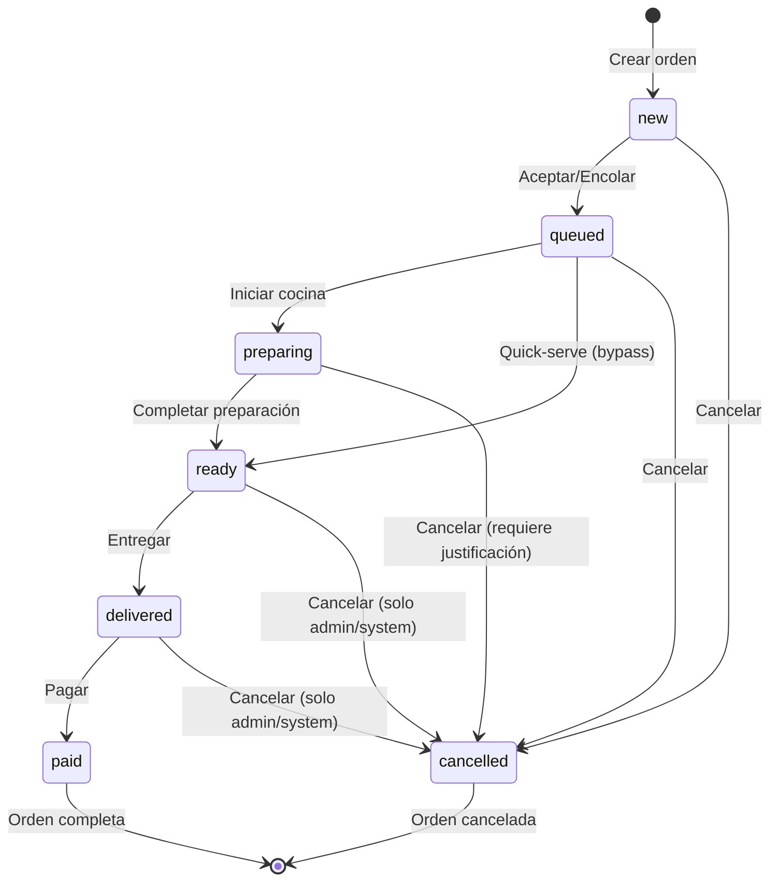

# Diagramas de Estado - PRONTO

## Resumen de Complejidad

| Métrica | Valor Actual | Umbral Máximo | Estado |
|---------|-------------|---------------|--------|
| Estados de Orden | 7 | ≤10 | ✅ OK |
| Estados de Sesión | 8 | ≤10 | ✅ OK |
| Estados de Pago | 6 | ≤8 | ✅ OK |
| Estados de Mesa | 4 | ≤5 | ✅ OK |
| Estados de Llamado | 4 | - | ✅ OK |
| Estados de Modificación | 4 | - | ✅ OK |
| Transiciones de Orden | 11 | ≤15 | ✅ OK |
| Roles | 5 | ≤6 | ✅ OK |
| Payment Providers | 3 | ≤4 | ✅ OK |

**Veredicto**: El sistema está dentro de los límites para un restaurante pequeño/mediano. ✅

---

## 1. OrderStatus - Estados de Órdenes (7 estados)

### Estados
```
new → queued → preparing → ready → delivered → paid
                          ↓
                      cancelled (terminal)
```

| Estado | Descripción | Actor Principal |
|--------|-------------|-----------------|
| `new` | Orden creada por cliente | Cliente |
| `queued` | En cola, esperando cocina | Mesero/Auto |
| `preparing` | En preparación | Chef |
| `ready` | Lista para entregar | Chef |
| `delivered` | Entregada al cliente | Mesero |
| `paid` | Pagada y cerrada | Cajero/Mesero |
| `cancelled` | Cancelada | Admin/System |

### Transiciones Permitidas (11 transiciones)



| De | A | Acción | Roles Permitidos | Requiere Justificación |
|----|---|--------|------------------|------------------------|
| new | queued | accept_or_queue | waiter, admin, system | No |
| new | cancelled | cancel | client, waiter, admin, system | No |
| queued | preparing | kitchen_start | chef, admin, system | No |
| queued | ready | skip_kitchen | waiter, chef, admin, system | No |
| queued | cancelled | cancel | client, waiter, admin, system | No |
| preparing | ready | kitchen_complete | chef, admin, system | No |
| preparing | cancelled | cancel | waiter, admin, system | ✅ Sí |
| ready | delivered | deliver | waiter, admin, system | No |
| ready | cancelled | cancel | admin, system | ✅ Sí |
| delivered | paid | pay | waiter, cashier, admin, system | No |
| delivered | cancelled | cancel | admin, system | ✅ Sí |

### Justificación de Complejidad

✅ **Apropiado para restaurante pequeño/mediano**:
- 7 estados cubren el ciclo completo: crear → aceptar → preparar → servir → pagar
- Quick-serve permite bypass de cocina para items rápidos
- Cancelaciones con justificación solo en estados críticos (preparing, ready, delivered)
- No hay estados innecesarios como "confirmed" o "served"

---

## 2. SessionStatus - Estados de Sesión (8 estados)

### Estados
```
open → active → awaiting_tip → awaiting_payment → awaiting_payment_confirmation → paid
  ↓                                                      ↓
closed (terminal)                                   merged (terminal)
```

| Estado | Descripción | Persistente |
|--------|-------------|-------------|
| `open` | Sesión abierta, cliente ordenando | ✅ Sí |
| `active` | Sesión con órdenes activas | ✅ Sí |
| `awaiting_tip` | Esperando ingreso de propina | ⚡ Transitorio |
| `awaiting_payment` | Cliente pidió la cuenta | ⚡ Transitorio |
| `awaiting_payment_confirmation` | Pago con tarjeta en proceso | ⚡ Transitorio |
| `paid` | Sesión pagada completamente | ✅ Sí (terminal) |
| `closed` | Sesión cerrada manualmente | ✅ Sí (terminal) |
| `merged` | Sesión fusionada con otra | ✅ Sí (terminal) |

### Sets Auxiliares

```python
ACTIVE_SESSION_STATUSES = {open, active, awaiting_payment}
TERMINAL_SESSION_STATUSES = {merged, closed, paid}
```

### Justificación de Complejidad

✅ **Apropiado para restaurante pequeño/mediano**:
- Solo 2 estados persistentes requieren tracking en BD (open, active)
- Estados transitorios (awaiting_*) se manejan principalmente en memoria
- Estados terminales permiten cerrar o fusionar sesiones
- `merged` permite split bills/dividir cuentas entre amigos

---

## 3. PaymentStatus - Estados de Pago (6 estados)

### Estados
```
unpaid → awaiting_tip → processing → paid_pending_confirmation → paid
                                   ↓
                                failed (terminal)
```

| Estado | Descripción | Método |
|--------|-------------|--------|
| `unpaid` | Sin pagar | Todos |
| `awaiting_tip` | Esperando propina | Stripe/Clip |
| `processing` | Pago en proceso | Stripe/Clip |
| `paid_pending_confirmation` | Pago iniciado, esperando webhook | Stripe/Clip |
| `paid` | Pagado exitosamente | Todos |
| `failed` | Pago fallido | Stripe/Clip |

### Justificación de Complejidad

✅ **Apropiado para restaurante pequeño/mediano**:
- Para efectivo: unpaid → paid (simple)
- Para tarjeta: 6 estados manejan el flujo completo de Stripe/Clip
- Estados intermedios necesarios para pagos asíncronos (webhooks)
- No hay estados superfluos

---

## 4. TableStatus - Estados de Mesa (4 estados)

| Estado | Descripción |
|--------|-------------|
| `available` | Mesa disponible |
| `occupied` | Mesa con clientes activos |
| `reserved` | Mesa reservada para futuro |
| `indisposed` | Mesa fuera de servicio |

### Justificación

✅ **Apropiado**: 4 estados simples y suficientes para operación básica.

---

## 5. WaiterCallStatus - Estados de Llamado (4 estados)

| Estado | Descripción |
|--------|-------------|
| `pending` | Llamado enviado, esperando mesero |
| `confirmed` | Mesero confirmó que va |
| `cancelled` | Cliente canceló el llamado |
| `resolved` | Mesero atendió el llamado |

### Justificación

✅ **Apropiado**: Flujo simple de llamado de mesero.

---

## 6. ModificationStatus - Estados de Modificación (4 estados)

| Estado | Descripción |
|--------|-------------|
| `pending` | Modificación solicitada |
| `approved` | Modificación aprobada |
| `rejected` | Modificación rechazada |
| `applied` | Modificación aplicada a la orden |

### Justificación

✅ **Apropiado**: Flujo simple para modificar órdenes.

---

## Reglas de No Crecimiento

### PROHIBIDO sin justificación explícita:

1. **Agregar nuevos estados** a cualquier máquina de estados
2. **Agregar nuevas transiciones** fuera de las definidas
3. **Crear nuevas máquinas de estados** (solo las 6 actuales)
4. **Aumentar roles** más allá de los 5 canónicos
5. **Agregar payment providers** más allá de 4

### Si se requiere modificar:

1. Actualizar esta documentación
2. Actualizar la matriz de complejidad en delivery.log
3. Actualizar el umbral en AGENTS.md
4. Justificar por qué el cambio es necesario
5. Verificar que no excede el umbral máximo

---

## Decisiones de Diseño

### ¿Por qué 7 estados de orden y no menos?
- `new`: Permite cancelación fácil antes de que la cocina vea la orden
- `queued`: Distinción clara entre "esperando" y "preparando"
- `preparing`: Chef necesita saber qué está trabajando
- `ready`: Separación entre "terminado" y "entregado"
- `delivered`: Punto de no retorno antes de pago
- `paid/cancelled`: Estados terminales

### ¿Por qué 8 estados de sesión?
- Estados `awaiting_*` son transitorios y no persisten en BD
- Permiten flujos de pago complejos (propina → cuenta → pago)
- `merged` habilita split bills sin complejidad adicional

### ¿Por qué 6 estados de pago?
- Necesarios para pagos con tarjeta (Stripe/Clip)
- Flujo asíncrono requiere estados intermedios
- Para efectivo se usa solo: unpaid → paid

---

## Referencias

- **Constantes**: `pronto-libs/src/pronto_shared/constants.py`
- **State Machine**: `pronto-libs/src/pronto_shared/services/order_state_machine_core.py`
- **Delivery Log**: `delivery.log` (Matriz de Complejidad)
- **AGENTS.md**: Sección 25 - Verificación de Complejidad

---

*Documento actualizado: 2026-03-17*
*Versión del sistema: 1.0001*
